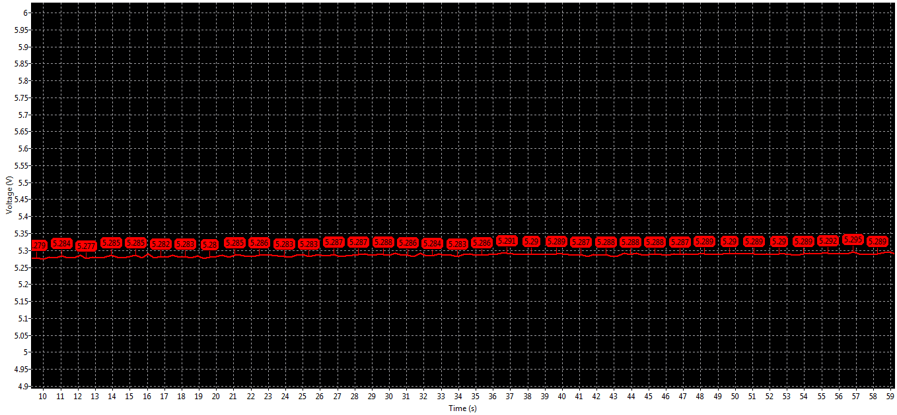
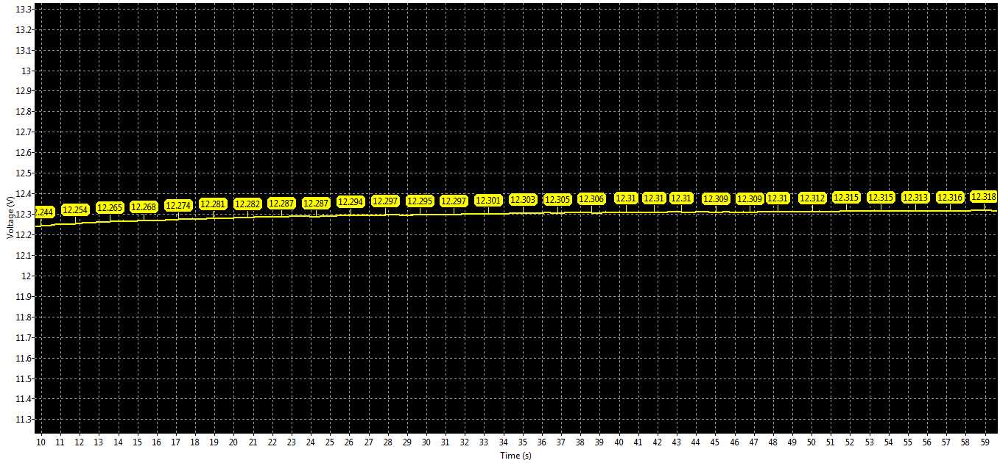
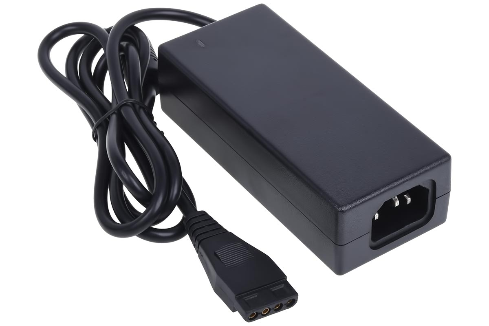

# HDD power reader
Cheap HDD power monitoring tool made with Arduino, Lazarus and DataPort library (https://github.com/serbod/dataport)

It consists of:
- `server` (such as Arduino) which will measure hard disk current and voltage (5V and 12V line), and send this information using serial communication
- `client` (Windows/Linux application) to read those values in real-time, draw a chart and save it as BMP/JPG/PNG

Example of server code can be found in `/server`, but feel free to adapt it to your needs.

For powering hard disk a 12V power adapter with molex plug is highly recommended:

